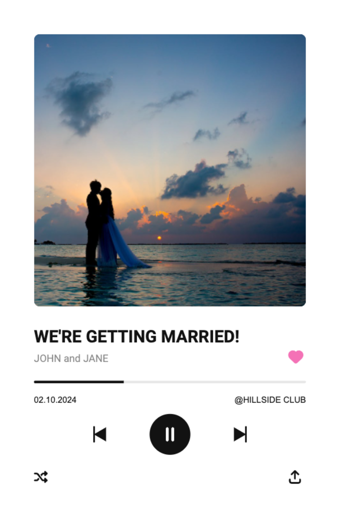

# Spotify Frame

[](https://github.com/Project-MZ/spotify-frame/actions/workflows/deploy.yml)

Frame your photo in a Spotify-like music player.

## Examples

|  |  |
| :----------------------------------------------------------------------------------------------------------------------: | :-------------------------------------------------------------------------------------------------: |

Credits:

- Photo by Asad Photo Maldives: https://www.pexels.com/photo/silhouette-photo-of-man-and-woman-kisses-between-body-of-water-1024968/
- Photo by Eric Esma: https://www.pexels.com/photo/man-wearing-denim-jacket-singing-on-stage-894156/

## Getting Started

```bash
yarn install
yarn dev
```
